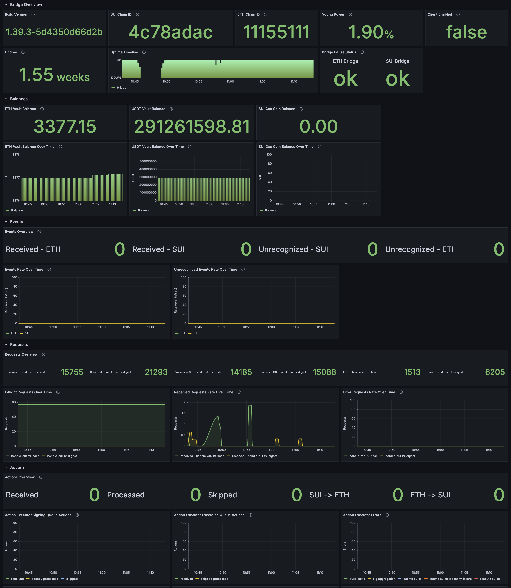
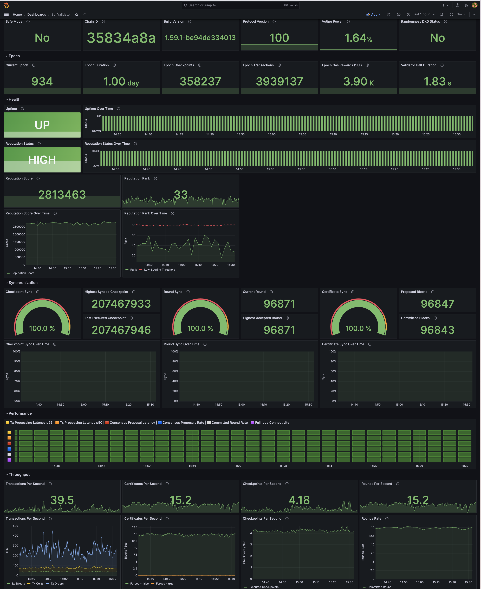
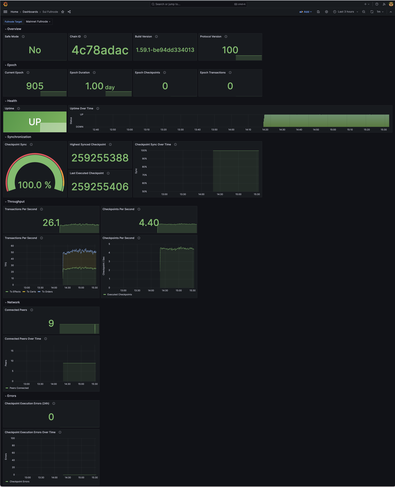

# 💧 **Sui Tools**


This repository provides a comprehensive **end-to-end monitoring solution** for **Sui services** using **Grafana**, **Prometheus**, and **Alertmanager**. It includes pre-configured dashboards, alert rules, and notification integrations designed for monitoring various Sui ecosystem services.

### **Supported Sui Services**

Currently supported services:
- **Sui Bridge** - Cross-chain bridge monitoring (Mainnet & Testnet)
- **Sui Validator** - Validator node performance and health monitoring
- **Sui Fullnode** - Fullnode monitoring and performance tracking

---

## 📋 **Prerequisites**

The monitoring stack requires:

- **Docker** (20.10+) and **Docker Compose** (2.0+)
- **Python 3.6+** with PyYAML library
- **Git** for cloning the repository

> 💡 **Automatic Installation**: The `monitor.sh` script can automatically install missing dependencies for you! When you run `./monitor.sh start`, it will:
> - Detect your operating system (Linux/macOS)
> - Check for missing dependencies
> - Offer to install them automatically with your confirmation
> - Support for Ubuntu, Debian, CentOS, RHEL, Fedora, and macOS

**Supported Package Managers:**
- **macOS**: Homebrew (requires Homebrew to be installed first)
- **Ubuntu/Debian**: apt-get
- **CentOS/RHEL/Fedora**: yum

**Manual Installation** (if you prefer):
```bash
# Verify what's installed
docker --version
docker compose version
python3 --version
python3 -c "import yaml" && echo "PyYAML is installed"

# Install PyYAML manually if needed
pip3 install PyYAML
# On macOS with newer Python, use:
# pip3 install PyYAML --break-system-packages
```

---

## 📦 **Quick Start**

### **1. Clone and Setup**

```bash
git clone https://github.com/sui-network/sui-tools.git
cd sui-tools
cp config.yml.template config.yml
```

### **2. Configure Services**

Edit the `config.yml` file with your specific configuration:

```yaml
# Grafana Configuration
grafana:
  admin_user: admin
  admin_password: your_secure_password
  port: 3000

# Prometheus Configuration
prometheus:
  port: 9090
  target: localhost:9090

# Alertmanager Configuration
alertmanager:
  port: 9093
  target: localhost:9093
  default_webhook_port: 3001

# Sui Bridge Configuration (Optional - only configure services you want to monitor)
bridges:
  - alias: "Production Mainnet"
    target: your-mainnet-target:9186
    public_address: your-mainnet-public-address
    alerts:
      # Common alerts (any bridge)
      uptime: true
      metrics_public_key_availability: true
      ingress_access: true
      voting_power: true
      
      # Client-disabled alerts
      bridge_requests_errors: true
      bridge_high_latency: true
      bridge_high_cache_misses: true
      bridge_rpc_errors: true
      
      # Client-enabled alerts
      stale_sui_sync: true
      stale_eth_sync: true
      stale_eth_finalization: true
      low_gas_balance: true
  - alias: "Test Network"
    target: your-testnet-target:9185
    public_address: your-testnet-public-address
    alerts:
      uptime: true
      metrics_public_key_availability: true
      # ... configure alerts per bridge

# Sui Validator Configuration
validators:
  - alias: "Production Validator"
    target: localhost:9184
    alerts:
      uptime: true
      voting_power: true
      tx_processing_latency_p95: true
      tx_processing_latency_p50: true
      proposal_latency: true
      consensus_proposals_rate: true
      committed_round_rate: true
      fullnode_connectivity: true
      safe_mode: true
      randomness_dkg_failure: true
      checkpoint_execution_rate: true
      
      # Warning alerts
      reputation_rank: true
      tx_processing_latency_p95_10s: true
      tx_processing_latency_p95_3s: true
      sequencing_latency_high: true

# Sui Fullnode Configuration (Optional)
fullnodes:
  - alias: "Mainnet Fullnode"
    target: localhost:9184
    alerts:
      uptime: true
      checkpoint_execution_rate: true
      checkpoint_sync_status: true
  - alias: "Testnet Fullnode"
    target: localhost:9185
    alerts:
      uptime: true
      checkpoint_execution_rate: true
      checkpoint_sync_status: true

# Authority Name
# This is your validator's authority name as it appears in metrics
authority: your_validator_authority_name      

# Notification Services (Optional)
pagerduty:
  integration_key: your_pagerduty_key

telegram:
  bot_token: your_telegram_bot_token
  chat_id: your_chat_id

discord:
  webhook_url: your_discord_webhook_url
```

> **💡 Dynamic Configuration**: The system automatically detects configured services (bridges, validators, fullnodes) and creates monitoring for each one. You can add any number of services with custom aliases. If a service type is not configured, its monitoring will be automatically skipped.

### **3. Start Monitoring**

Start all services using the management script:

```bash
./monitor.sh start
```

The script will automatically:
- Detect your platform (Linux/macOS) and use the appropriate configuration
- Validate your `config.yml` configuration
- Generate all necessary configurations (Prometheus, Alertmanager, alert rules)
- Start all services with proper health checks
- Display service status and access URLs

### **4. Access Services**

Once services are running, access them at:

- **Grafana Dashboard**: [http://localhost:3000](http://localhost:3000)
  - Login with credentials from your `config.yml`
- **Prometheus**: [http://localhost:9090](http://localhost:9090)
- **Alertmanager**: [http://localhost:9093](http://localhost:9093)

### **5. Verify Setup**

Check that everything is working:

```bash
# View service status
./monitor.sh status

# Check service logs
./monitor.sh logs grafana
./monitor.sh logs prometheus
./monitor.sh logs alertmanager

# Verify Prometheus targets
# Open http://localhost:9090/targets in your browser

# Verify alert rules
# Open http://localhost:9090/alerts in your browser
```

---

## 🏗️ **Architecture & Structure**

### **Repository Structure**

```
sui-tools/
├── README.md                        # Project documentation
├── config.yml                       # Main configuration file (user-editable)
├── config.yml.template              # Configuration template
├── monitor.sh                       # Management script
├── assets/                          # Project assets
│   ├── sui_bridge.png
│   └── sui_header.png
├── config/                          # Static configuration templates
│   ├── alertmanager/
│   │   ├── alertmanager.yml         # Static template (for reference)
│   │   └── generated_alertmanager.yml  # Auto-generated (used by container)
│   ├── blackbox/
│   │   ├── blackbox.yml
│   │   └── entrypoint.sh
│   ├── grafana/
│   │   ├── dashboards/
│   │   │   ├── dashboards.yml
│   │   │   ├── sui_bridge.json
│   │   │   ├── sui_fullnode.json
│   │   │   └── sui_validator.json
│   │   ├── datasources/
│   │   │   └── datasources.yml
│   │   ├── entrypoint.sh
│   │   ├── generated_fullnodes.json   # Auto-generated fullnodes metadata
│   │   └── generated_validators.json  # Auto-generated validators metadata
│   └── prometheus/
│       ├── entrypoint.sh
│       ├── generated_bridges.json      # Auto-generated bridges metadata
│       ├── generated_prometheus.yml    # Auto-generated (used by container)
│       └── rules/
│           ├── sui_bridge_*_alerts.yml     # Auto-generated per bridge
│           ├── sui_fullnode_*_alerts.yml   # Auto-generated per fullnode
│           └── sui_validator_*_alerts.yml  # Auto-generated per validator
├── data/                            # Persistent data storage
│   ├── alertmanager/
│   ├── grafana/
│   └── prometheus/
├── docker-compose.yml               # Linux configuration
├── docker-compose.macos.yml         # macOS configuration
├── generated_configs/               # Auto-generated configs (runtime)
│   ├── prometheus.yml               # Generated Prometheus config
│   ├── alertmanager.yml             # Generated Alertmanager config
│   ├── bridges.json                 # Bridge metadata JSON
│   ├── validators.json              # Validator metadata JSON
│   ├── fullnodes.json               # Fullnode metadata JSON
│   └── alert_rules/                 # Generated alert rules per service
│       ├── sui_bridge_0_*_alerts.yml      # Per-bridge alerts
│       ├── sui_bridge_1_*_alerts.yml
│       ├── sui_validator_0_*_alerts.yml   # Per-validator alerts
│       ├── sui_validator_1_*_alerts.yml
│       ├── sui_fullnode_0_*_alerts.yml    # Per-fullnode alerts
│       └── sui_fullnode_1_*_alerts.yml
└── scripts/                         # Configuration processing
    └── parse_config.py              # Python parser (generates all configs)
```

---

## 📊 **Monitoring Features**

### **Conditional Service Deployment**

The monitoring stack automatically adapts based on your configuration:

- **Dynamic Service Detection**: Automatically detects and monitors any number of configured bridges, validators, and fullnodes
- **Custom Aliases**: Use human-readable names instead of hardcoded "mainnet"/"testnet" labels
- **Dashboard Provisioning**: Service-specific dashboards are only loaded when services are configured
- **Alert Rules**: Only active for configured services with explicitly enabled alerts
- **Resource Optimization**: Unused monitoring components are automatically skipped
- **Python-based Configuration**: Dynamic Prometheus config generation with proper validation

### **Pre-configured Dashboards**

The system includes three pre-configured Grafana dashboards for comprehensive monitoring:

#### **Sui Bridge Dashboard**



Comprehensive monitoring of Sui Bridge Node performance including:
- Bridge health and uptime metrics
- ETH and SUI synchronization status
- Transaction processing rates
- Gas balance monitoring
- RPC latency and error rates

#### **Sui Validator Dashboard**



Complete validator node performance and health monitoring including:
- Validator uptime and voting power
- Transaction processing latency (P50, P95)
- Consensus metrics (proposals, commits)
- Reputation and performance rankings
- Checkpoint execution rates

#### **Sui Fullnode Dashboard**



Fullnode monitoring and performance tracking including:
- Fullnode uptime and health
- Checkpoint execution and sync status
- Network connectivity metrics
- Transaction processing performance

### **Alert Rules**

The system includes comprehensive alert rules for configured services. Alerts are **opt-in** - you must explicitly enable each alert type in your `config.yml` for each service.

#### **Sui Bridge Alerts**

Available alert types per bridge (12 alerts):

1. **uptime** - Detects unexpected node restarts or failures
2. **metrics_public_key_availability** - Monitors metrics endpoint accessibility
3. **ingress_access** - Monitors public bridge endpoint availability
4. **voting_power** - Critical validator voting rights issues
5. **bridge_requests_errors** - Transaction digest handling failures
6. **bridge_high_latency** - ETH RPC query performance issues
7. **bridge_high_cache_misses** - Inefficient cache utilization
8. **bridge_rpc_errors** - SUI RPC query failures
9. **stale_sui_sync** - SUI checkpoint synchronization stalled
10. **stale_eth_sync** - ETH block synchronization stalled
11. **stale_eth_finalization** - ETH finalization not progressing
12. **low_gas_balance** - Bridge client gas balance below threshold (10 SUI)

Each bridge can have its own alert configuration. Only explicitly enabled alerts will be generated and monitored.

#### **Sui Validator Alerts**

Available alert types per validator (11 alerts):

1. **uptime** - Detects unexpected validator restarts or failures (5m window)
2. **voting_power** - Critical validator voting rights issues (5m window)
3. **tx_processing_latency_p50** - P50 transaction latency threshold monitoring (5m window)
4. **proposal_latency** - Consensus proposal latency monitoring (5m window)
5. **consensus_proposals_rate** - Consensus proposals rate monitoring (5m window)
6. **safe_mode** - Safe mode activation detection (5m window)
7. **randomness_dkg_failure** - Randomness beacon DKG failure detection (5m window)
8. **checkpoint_execution_rate** - Checkpoint execution rate monitoring (5m window)
9. **reputation_rank** - Validator reputation rank monitoring (30m window)
10. **sequencing_latency_high** - Sequencing latency monitoring (5m window)
11. **committed_round_rate** - Committed round rate monitoring (5m window)

Each validator can have its own alert configuration. Only explicitly enabled alerts will be generated and monitored.

#### **Sui Fullnode Alerts**

Available alert types per fullnode (3 alerts):

1. **uptime** - Detects unexpected fullnode restarts or failures (2m window)
2. **checkpoint_execution_rate** - Checkpoint execution rate < 2 checkpoints/s (5m window)
3. **checkpoint_sync_status** - Checkpoint sync ratio < 95%, indicating node is falling behind (5m window)

Each fullnode can have its own alert configuration. Only explicitly enabled alerts will be generated and monitored.

### **Notification Channels (Contact Points)**

The monitoring stack supports multiple notification channels that are **automatically configured** based on credentials provided in `config.yml`. Configure any combination of channels that work best for your team.

#### **PagerDuty**

Professional incident management with escalation policies.

```yaml
pagerduty:
  integration_key: "your_pagerduty_integration_key"  # Events API v2 routing key
```

**Features:**
- Automatic incident creation and tracking
- Rich alert details (severity, service, instance, summary, description)
- Auto-resolve when alert clears
- Integrates with your existing escalation policies

**Setup:**
1. Log into PagerDuty
2. Go to Services → Select/Create Service
3. Click "Integrations" → "Add Integration"
4. Choose "Events API v2"
5. Copy the Integration Key (routing key)

#### **Telegram**

Instant mobile and desktop notifications.

```yaml
telegram:
  bot_token: "your_telegram_bot_token"  # From @BotFather
  chat_id: "your_chat_id"               # Your Telegram chat ID (can be negative for groups)
```

**Features:**
- HTML formatted messages with emojis (🚨 for critical, ⚠️ for warnings)
- Detailed alert information
- Resolved notifications
- Works on any device (mobile, desktop, web)

**Setup:**
1. Create a bot: Message @BotFather on Telegram → `/newbot`
2. Copy the bot token
3. Start a chat with your bot → Send any message
4. Get your chat ID: `https://api.telegram.org/bot<YOUR_BOT_TOKEN>/getUpdates`
5. Look for "chat":{"id": number} in the response

#### **Discord**

Team notifications in your Discord server.

```yaml
discord:
  webhook_url: "your_discord_webhook_url"
```

**Features:**
- Markdown formatted messages
- Visual distinction between critical and warning alerts
- Detailed alert information with service and instance details
- Resolved notifications

**Setup:**
1. Open Discord → Go to your channel
2. Click channel settings (gear icon)
3. Go to "Integrations" → "Webhooks"
4. Click "New Webhook" or "Copy Webhook URL"
5. Paste the URL in `config.yml`

#### **Webhook**

Generic HTTP endpoint for custom integrations.

```yaml
alertmanager:
  default_webhook_port: 3001  # Your webhook receiver port
```

All alerts can be sent to your custom webhook receiver at `http://localhost:3001`.

#### **Alert Routing**

**Default routing behavior:**
- **Critical alerts** → Sent to all configured channels (PagerDuty, Telegram, Discord, Webhook)
- **Warning alerts** → Sent to Telegram, Discord, and Webhook

You can configure any combination of notification channels. The system will:
- Only send alerts to channels you've configured
- Automatically validate your configuration
- Show which channels are active when you start the monitoring stack

**Example configurations:**

```yaml
# Option 1: PagerDuty for incidents, Telegram for all alerts
pagerduty:
  integration_key: "your_key"
telegram:
  bot_token: "your_token"
  chat_id: "your_id"

# Option 2: Discord only for team notifications
discord:
  webhook_url: "your_webhook"

# Option 3: All channels for maximum coverage
pagerduty:
  integration_key: "your_key"
telegram:
  bot_token: "your_token"
  chat_id: "your_id"
discord:
  webhook_url: "your_webhook"
```

Simply configure the channels you want, leave others empty, and the system handles the rest!

### **Configuration Processing**

The system uses a **Python-based configuration parser** (`scripts/parse_config.py`) that automatically generates all service configurations from your `config.yml`:

**Generated Configurations:**
- **Prometheus config** (`generated_configs/prometheus.yml`) - Dynamic scrape targets for all services
- **Alert rules** (`generated_configs/alert_rules/*.yml`) - Service-specific alert rules based on enabled alerts
- **Alertmanager config** (`generated_configs/alertmanager.yml`) - Notification receivers based on configured integrations
- **Service metadata** (`generated_configs/*.json`) - Bridge, validator, and fullnode configuration for Grafana dashboards

**Features:**
- **Validates YAML configuration** with comprehensive error handling
- **Supports custom bridge aliases** instead of hardcoded network names
- **Opt-in alert configuration** - only enabled alerts are generated
- **Conditional notification setup** - only configured services are included
- **Exports environment variables** for Docker Compose integration

**Requirements:**
- Python 3.6+ with PyYAML (`pip3 install PyYAML`)
- The parser runs on the host machine during startup/restart

**How it works:**
1. You edit `config.yml` with your settings
2. Run `./monitor.sh start` or `./monitor.sh restart`
3. Parser generates all configs in `generated_configs/`
4. Configs are copied to respective service directories
5. Services start/restart with updated configurations

---

### **Configuration Options**

The `config.yml` file supports the following configuration sections:

| Section | Option | Description | Required |
|---------|--------|-------------|----------|
| **grafana** | `admin_user` | Grafana admin username | ✅ |
| | `admin_password` | Grafana admin password | ✅ |
| | `port` | Grafana web interface port | ❌ (default: 3000) |
| **prometheus** | `port` | Prometheus port | ❌ (default: 9090) |
| | `target` | Prometheus target | ❌ (default: localhost:9090) |
| **alertmanager** | `port` | Alertmanager port | ❌ (default: 9093) |
| | `target` | Alertmanager target | ❌ (default: localhost:9093) |
| | `default_webhook_port` | Default webhook port | ❌ (default: 3001) |
| **bridges** | `alias` | Human-readable bridge name | ❌* |
| | `target` | Bridge target endpoint (IP:port) | ❌* |
| | `public_address` | Bridge public HTTP address | ❌ |
| | `alerts` | Per-bridge alert enable/disable flags | ❌ |
| **validators** | `alias` | Human-readable validator name | ❌** |
| | `target` | Validator metrics endpoint (IP:port) | ❌** |
| | `alerts` | Per-validator alert enable/disable flags | ❌ |
| **authority** | - | Validator authority name (as shown in metrics) | ❌** |
| **fullnodes** | `alias` | Human-readable fullnode name | ❌*** |
| | `target` | Fullnode metrics endpoint (IP:port) | ❌*** |
| | `alerts` | Per-fullnode alert enable/disable flags | ❌ |
| **pagerduty** | `integration_key` | PagerDuty integration key | ❌ |
| **telegram** | `bot_token` | Telegram bot token | ❌ |
| | `chat_id` | Telegram chat ID | ❌ |
| **discord** | `webhook_url` | Discord webhook URL | ❌ |

*Required only if you want to monitor Sui Bridge services. You can configure any number of bridges with custom aliases. If no bridges are configured, bridge monitoring will be skipped.

**Required only if you want to monitor Sui Validator nodes. You can configure any number of validators with custom aliases. The `authority` field is required when configuring validators to set the authority name for alerts and metrics.

***Required only if you want to monitor Sui Fullnode services. You can configure any number of fullnodes with custom aliases. If no fullnodes are configured, fullnode monitoring will be skipped.

### **Service Configuration**

#### **Grafana**
- **Version**: 10.2.0 (latest stable)
- **Port**: 3000 (configurable)
- **Database**: SQLite (configurable to PostgreSQL/MySQL)
- **Plugins**: Support for GitHub plugin installation
- **Provisioning**: Automatic datasource and dashboard provisioning

#### **Prometheus**
- **Version**: v2.47.0 (latest stable)
- **Retention**: 15 days / 10GB (configurable)
- **Scrape Interval**: 15 seconds
- **Admin API**: Enabled for configuration management

#### **Alertmanager**
- **Version**: v0.26.0 (latest stable)
- **Routing**: Intelligent alert routing based on severity
- **Grouping**: Alerts grouped by service and environment
- **Inhibition**: Prevents alert spam with inhibition rules

---

## 🔧 **Advanced Usage**

### **Custom Dashboards**

Add custom dashboards by placing JSON files in `grafana/dashboards/`. The system will automatically provision them.

### **Additional Alert Rules**

Add new alert rules by creating YAML files in `prometheus/rules/`. The system will automatically load them.

### **Plugin Management**

Install Grafana plugins using the `GF_GITHUB_PLUGINS` environment variable:

```bash
GF_GITHUB_PLUGINS="https://github.com/grafana/grafana-clock-panel/releases/download/v1.3.0/grafana-clock-panel-1.3.0.zip"
```


---

## 🚨 **Troubleshooting**

### **Service Health Checks**

Check service status using the management script:
```bash
# View overall service status
./monitor.sh status

# View detailed logs for specific services
./monitor.sh logs grafana
./monitor.sh logs prometheus
./monitor.sh logs alertmanager

# View logs for all services
./monitor.sh logs
```

### **Common Issues**

**1. Missing Dependencies**

If you see an error about missing dependencies:
```bash
# The script will offer to install missing dependencies automatically
./monitor.sh start

# Or verify prerequisites manually
python3 --version  # Should be 3.6+
docker --version
docker compose version
python3 -c "import yaml" && echo "PyYAML is installed"
```

The script supports automatic installation on:
- Ubuntu/Debian (using apt-get)
- CentOS/RHEL/Fedora (using yum)
- macOS (using Homebrew - must be installed first)

**2. Services Not Starting**
```bash
# Check what went wrong
./monitor.sh logs

# Restart services
./monitor.sh restart
```

**3. Configuration Issues**
```bash
# After editing config.yml, always restart
./monitor.sh restart

# This will regenerate all configurations and restart services
```

**4. Docker Permission Issues**

If you see warnings about environment variables or need to run with `sudo`:

```bash
# Add your user to the docker group (Linux only)
sudo usermod -aG docker $USER

# Log out and log back in for changes to take effect
# Or use: newgrp docker

# Now you can run without sudo
./monitor.sh start
```

**Why this matters:**
- Running with `sudo` can cause environment variable issues
- Docker group membership allows running Docker commands without sudo
- Provides better security and cleaner environment handling

**If you must use sudo:**
```bash
# The script will warn you but continue to work
sudo ./monitor.sh start
```

**5. Data Directory Permission Errors**
```bash
# Ensure data directories have proper permissions
mkdir -p data/grafana data/prometheus data/alertmanager
chmod -R 755 data/
```

**6. Port Conflicts**

Check if required ports (3000, 9090, 9093) are available:
```bash
lsof -i :3000  # Grafana
lsof -i :9090  # Prometheus
lsof -i :9093  # Alertmanager
```

If ports are in use, you can customize them in `config.yml`:
```yaml
grafana:
  port: 3001  # Change to available port
prometheus:
  port: 9091
alertmanager:
  port: 9094
```

**7. Python/PyYAML Issues**
```bash
# The script can install PyYAML automatically
./monitor.sh start

# Or install manually
pip3 install PyYAML

# On macOS with newer Python:
pip3 install PyYAML --break-system-packages
```

**8. Configuration Validation**

The `monitor.sh` script validates configurations during start/restart. To manually check:
```bash
# Test configuration parsing
python3 scripts/parse_config.py config.yml generated_configs/prometheus.yml generated_configs/alert_rules
```

**9. Network/Target Issues**

**Platform-Specific Networking:**

The monitoring stack uses different networking modes on different platforms:
- **Linux**: Uses `network_mode: host` (all containers share host network)
- **macOS**: Uses bridge networking (containers have their own network)

**Configuration Guidelines:**

For `prometheus.target` and `alertmanager.target` in `config.yml`:
```yaml
# Linux: Use localhost (services are on host network)
prometheus:
  target: localhost:9090
alertmanager:
  target: localhost:9093

# macOS: Can use localhost or prometheus/alertmanager service names
# The defaults work on both platforms
```

For monitoring your own services (bridges, validators, fullnodes):
```yaml
# Linux: Use your server's IP or localhost
bridges:
  - alias: "My Bridge"
    target: localhost:9186  # or your_server_ip:9186

# macOS: Use host.docker.internal to reach host services
bridges:
  - alias: "My Bridge"
    target: host.docker.internal:9186
```

**Common Issues:**
- Verify bridge and validator targets are accessible from the monitoring server
- Check bridge aliases are unique
- Ensure public addresses (for ingress monitoring) are reachable
- Test connectivity: `curl http://your_target:port/metrics`

### **Management Script Reference**

The `monitor.sh` script is your primary tool for managing the monitoring stack:

**Core Commands:**
```bash
./monitor.sh start     # Start all services (auto-detects platform)
./monitor.sh stop      # Stop all services gracefully
./monitor.sh restart   # Restart with fresh configurations
./monitor.sh status    # Show service health status
```

**Monitoring Commands:**
```bash
./monitor.sh logs                 # View logs from all services
./monitor.sh logs grafana         # View logs from specific service
./monitor.sh logs prometheus -f   # Follow logs in real-time
```

**Data Management:**
```bash
./monitor.sh backup                        # Create backup of all data
./monitor.sh restore backup-file.tar.gz    # Restore from backup
./monitor.sh clean                         # Clean up old data
```

**Key Features:**
- ✅ **Automatic platform detection** (Linux vs macOS)
- ✅ **Configuration validation** before starting services
- ✅ **Dependency checking** (Docker, Python, PyYAML)
- ✅ **Dynamic config generation** from your `config.yml`
- ✅ **Health monitoring** with automatic status checks
- ✅ **Error handling** with helpful error messages

### **Platform-Specific Behavior**

The monitoring stack automatically adapts to your platform:

**Linux:**
- Uses `network_mode: host` for optimal performance
- Services communicate via `localhost`
- Direct access to host network interfaces
- Use `localhost` for bridge/validator targets

**macOS:**
- Uses bridge networking (macOS doesn't support host mode)
- Services communicate via Docker network
- Use `host.docker.internal` instead of `localhost` for host services
- Example: `target: host.docker.internal:9186`

The `monitor.sh` script automatically selects the correct Docker Compose file for your platform.

---

### **Updating Services**

To update to newer versions, modify the image tags in `docker-compose.yml` or `docker-compose.macos.yml`, then restart:

```bash
./monitor.sh stop
./monitor.sh start
```

### **Configuration Changes**

After modifying `config.yml`, always use the restart command:

```bash
./monitor.sh restart
```

**What this does:**
1. Validates your `config.yml` for errors
2. Regenerates all configurations (Prometheus targets, alert rules, Alertmanager notifications)
3. Stops all containers gracefully
4. Starts containers with fresh configurations
5. Verifies service health

> ⚠️ **Important**: Always use `./monitor.sh restart` after editing `config.yml`. This ensures all configuration changes (bridges, validators, alerts, notifications) are properly regenerated and applied.

### **Data Management**

**Backup your data:**
```bash
./monitor.sh backup
```

**Restore from backup:**
```bash
./monitor.sh restore backup-YYYYMMDD.tar.gz
```

**Clean up old data:**
```bash
./monitor.sh clean
```

---

## 🤝 **Contributing**

Contributions are welcome! Please:

1. Fork the repository
2. Create a feature branch
3. Make your changes
4. Add tests if applicable
5. Submit a pull request

### **Development Setup**

For local development and testing:

```bash
# Start services in foreground to see logs
./monitor.sh start

# In another terminal, make changes to config.yml
# Then restart to apply changes
./monitor.sh restart

# Check logs in real-time
./monitor.sh logs -f

# Stop services when done
./monitor.sh stop
```

**Testing configuration changes:**
```bash
# Validate config without starting services
python3 scripts/parse_config.py config.yml generated_configs/prometheus.yml

# Check generated configurations
cat generated_configs/prometheus.yml
cat generated_configs/alertmanager.yml
ls -la generated_configs/alert_rules/
```

---

## ⚡ **Quick Reference**

### **Common Commands**

```bash
# Service Management
./monitor.sh start           # Start all services
./monitor.sh stop            # Stop all services
./monitor.sh restart         # Restart with new config
./monitor.sh status          # Check service health

# Monitoring & Logs
./monitor.sh logs            # View all logs
./monitor.sh logs grafana    # View specific service logs
./monitor.sh logs -f         # Follow logs in real-time

# Data Management
./monitor.sh backup          # Backup all data
./monitor.sh restore FILE    # Restore from backup
./monitor.sh clean           # Clean up old data
```

### **Access URLs**

| Service | URL | Purpose |
|---------|-----|---------|
| **Grafana** | http://localhost:3000 | Dashboards and visualization |
| **Prometheus** | http://localhost:9090 | Metrics database and queries |
| **Prometheus Targets** | http://localhost:9090/targets | Check scraping status |
| **Prometheus Alerts** | http://localhost:9090/alerts | View alert rules and status |
| **Alertmanager** | http://localhost:9093 | Alert routing and notifications |

### **Configuration Files**

| File | Purpose |
|------|---------|
| `config.yml` | Main configuration (edit this) |
| `config.yml.template` | Configuration template with examples |
| `generated_configs/` | Auto-generated configs (don't edit) |
| `data/` | Persistent data storage |
| `monitor.sh` | Management script |

### **Key Concepts**

- **Always use `./monitor.sh restart`** after editing `config.yml`
- **Alerts are opt-in** - explicitly enable each alert type per service
- **Platform auto-detection** - script automatically uses correct config for Linux/macOS
- **Dynamic configuration** - add any number of bridges/validators with custom aliases
- **On macOS** - use `host.docker.internal` instead of `localhost` for host services

---

## 📝 **License**

This repository is licensed under the **MIT License**. See the [LICENSE](LICENSE) file for details.

---

## 🆘 **Support**

For issues and questions:

- **GitHub Issues**: [Create an issue](https://github.com/sui-network/sui-tools/issues)
- **Documentation**: Check this README and inline comments
- **Community**: Join the Sui community for support

---

**Made with ❤️ for the Sui ecosystem**